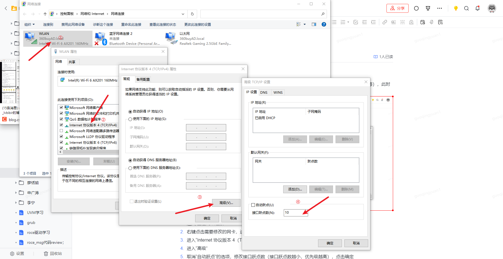

# Windows网卡优先级配置
连接有线网卡后，Windows可以通过无线 & 有线同时访问网络，但是有线无法访问外网（Google等），此时可以通过调整网卡访问优先级更改访问网络的顺序。



1. 进入“查看网络连接”
2. 右键点击需要修改的网卡，进入“属性”
3. 进入“Internet 协议版本 4（TCP/IPv4）”
4. 进入“高级”
5. 取消“自动跃点”的选项，修改接口跃点数（接口跃点数越小，优先级越高），点击确定
6. 同时修改另一个网卡，配置成功后即可修改访问网卡的优先级

# Linux修改网络相关配置
可以使用`ifconfig`命令对IP地址、MAC地址等相关网络信息进行修改
```bash
ifconfig eth0 down
# 设置IP以及子网掩码
ifconfig eth0 192.168.1.4 netmask 255.255.255.0
# 设置MAC地址
ifconfig eth0 hw ether 00:AA:BB:CC:DD:EE
ifconfig eth0 up
```
以上命令用于临时更改网络配置，如果需要长期生效，可以更改脚本`ifcfg-eth0`
```bash
vim /etc/sysconfig/network-scripts/ifcfg-eth0 # Red Hat
vim /etc/netplan/00-installer-config.yaml # Debain/Ubuntu

# 修改后重启网络服务生效
```