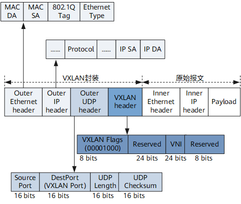

# 计算机网络知识点总结

# VXLAN
[VXLAN报文格式](https://support.huawei.com/enterprise/zh/doc/EDOC1100138284/f95c6e68)

VXLAN报文结构如下图所示

|  字段  | 描述 | 备注 |
|  :----:  | :----:  | :----: |
| VXLAN header | VXLAN Flags VNI  |  |
| Outer UDP header | SourcePort DestPort  |  |
| Outer IP header | IP SA |  |
| Outer Ethernet header | MAC DA |  |

VXLAN技术是一种伴随着虚拟化技术产生的隧道技术，它最大的特点将L2数据帧封装在L4中，并在L3层进行传输。VXLAN报文的交互流程如下：
1. VM A 需要将报文发送给 VM B
2. VM A 将带有Inner Ethernet header、Inner IP header 和 Payload 的报文发送给 VM A 对应的 Host A，此处称为 VTEP(VXLAN Tunnel Endpoint) A
3. VTEP A 将该报文打上 VXLAN header，作为 UDP 的 Payload
4. VTEP A 将报文依次打上 UDP header、IP header 和 Ethernet header，通过 Underlay 网络将该报文发送给对端的 VTEP B
5. VTEP B 取出 UDP 的 Payload，该报文含有 VXLAN 头部
6. 解析该VXLAN header，根据 VNI 等将报文送至指定的 VM B

