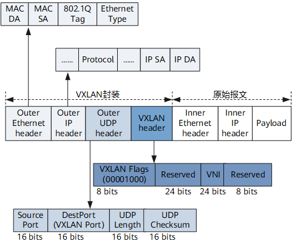

# Markdown语法

# 图片


```markdown

```

默认左对齐


# 表格
## 样式
|  组合键  | 功能 | 备注 |
| :----: | :---- | ----: |
| Ctrl-a | 回到行首 | 超级有用 |
| Ctrl-e | 回到行尾 |  |

```markdown
|  组合键  | 功能 | 备注 |
| :----: | :---- | ----: |
| Ctrl-a | 回到行首 | 超级有用 |
| Ctrl-e | 回到行尾 |  |
```