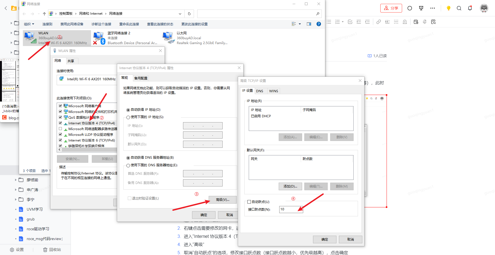

# 奇奇怪怪的小总结

# Windows网卡优先级配置
连接有线网卡后，Windows可以通过无线 & 有线同时访问网络，但是有线无法访问外网（Google等），此时可以通过调整网卡访问优先级更改访问网络的顺序。



1. 进入“查看网络连接”
2. 右键点击需要修改的网卡，进入“属性”
3. 进入“Internet 协议版本 4（TCP/IPv4）”
4. 进入“高级”
5. 取消“自动跃点”的选项，修改接口跃点数（接口跃点数越小，优先级越高），点击确定
6. 同时修改另一个网卡，配置成功后即可修改访问网卡的优先级

# Linux修改网络相关配置
可以使用`ifconfig`命令对IP地址、MAC地址等相关网络信息进行修改
```bash
ifconfig eth0 down
# 设置IP以及子网掩码
ifconfig eth0 192.168.1.4 netmask 255.255.255.0
# 设置MAC地址
ifconfig eth0 hw ether 00:AA:BB:CC:DD:EE
ifconfig eth0 up
```
以上命令用于临时更改网络配置，如果需要长期生效，可以更改脚本`ifcfg-eth0`
```bash
vim /etc/sysconfig/network-scripts/ifcfg-eth0 # Red Hat
vim /etc/netplan/00-installer-config.yaml # Debain/Ubuntu

# 修改后重启网络服务生效
```

# NUMA
## 问题描述
采用fwd模式，利用iperf双向打流观测性能，以验证硬件卸载功能是否生效。Host A -> Host B 可以达到性能指标，而 Host B -> Host A 却无法达到带宽上限。

## 测试过程
1. 由iperf默认的TCP改为UDP，限制带宽为20G，A -> B 可以达到带宽上限，而 B -> A 依旧无法达到带宽上限
2. 尝试将单线程打流拓展为多线程，当线程数较少时，性能有所提升但是依旧无法达到线速；线程数较多时，可以达到带宽上限
3. 尝试多次使用同一线程数（与队列数一致）打流，带宽变化明显，且少次可以探峰；多次使用多线程（大于8）打流，稳定线速带宽

## 解决方法
1. 线程越多，线程分布的CPU越分散，因此带宽越接近线速且越稳定
2. 利用NUMA解释为什么线程随机分散在更多的CPU上时性能越好
3. 将iperf的服务器端绑定到驱动挂载的 NUMA node 的 CPU 上，以解决跨NUMA node访问内存带来的性能损耗问题

## 基本说明
非一致性内存访问（Non-Uniform Memory Access，NUMA）是一种计算机内存的设计方式。传统的设计架构中，内存与CPU分隔于两侧，中间通过北桥相连。其带来的问题是，CPU每次进行内存访问时，都必须要跨越北桥，从而带来访问延迟。双节点NUMA架构将多核分离成两个含有相等核数的部分，中间通过快速路径互联，内存也分布在两个位置，仅与其中一个部分通过内存通道连接。这种情况下，会出现`Local Access`和`Remote Access`的区别。在分配内存时，应该尽量分配离CPU近的内存，如果出现分配到远端内存的情况，则可以通过`numactl`命令控制进程使用的CPU和内存。


## 推荐阅读
[NUMA影响程序延迟](https://draveness.me/whys-the-design-numa-performance/)

# 网卡名称长度限制
使用ifconfig配置网卡名时，需要注意长度不能超过13字节，原因是内核中针对网络接口名做了长度限制
```c
// include/linux/socket.h
struct scokaddr {
    sa_family_t sa_family; /* address family, AF_xxx */
    char sa_data[14]; /* 14 bytes of protocol address */
};
```
超过13字节的部分将被截断

# 网卡工作模式
## 分类
网卡有以下几种工作模式：
1. **广播模式（Broadcast）**：物理地址为0xffffff的广播帧，工作在广播模式的网卡接收广播帧，它将会接收所有目的地址为广播地址的数据包，一般网卡都会设置为这个模式
2. **多播模式（Multicast）**：多播传送地址作为目的物理地址的帧可以被组内的其他主机同时接收，而组外主机却接收不到。但是，如果将网卡设置为多播传送模式，它可以接收所有的多播传送帧，而不论是不是组内成员。当数据包为目的地址为多播地址，而且网卡地址是属于那个多播地址所代表的多播组时，网卡将接收此数据包，即使一个网卡并不是一个多播组的成员，程序也可以将网卡设置为多播模式而接收那些多播数据包。（**1.设置为多播传送模式的网卡可以接收所有多播传送帧；2.即使没有设置成多播传送模式，但是网卡地址属于某个多播组，也能收到该多播组的数据包**）
3. **直接模式（Direct）**：只接收目的地址是自己MAC地址的帧。只有当数据包的目的地址为网卡自己的地址时，网卡才接收它
4. **混杂模式（Promiscuous）**：工作在混杂模式的网卡接收所有的流过网卡的帧，抓包程序运行在这种模式下。网卡的缺省工作模式包含广播模式和直接模式。如果采用混杂模式，网卡将接收同一网络内所发送的数据包，达到对于网络信息监视捕获的目的。

## 配置
```bash
ifconfig eth0
# => 观察flags的状态
# eth0: flags=4163<UP,BROADCAST,RUNNING,MULTICAST>  mtu 1500

# 开启混杂模式
ifconfig eth0 promisc

# 取消混杂模式
ifconfig eth0 -promisc
```

## 参考
[理解网卡混杂模式](https://zdyxry.github.io/2020/03/18/%E7%90%86%E8%A7%A3%E7%BD%91%E5%8D%A1%E6%B7%B7%E6%9D%82%E6%A8%A1%E5%BC%8F/)


# Netfilter框架
## 参考
[走进Linux内核之Netfilter框架](https://juejin.cn/post/7008945265021288484)

[连接跟踪（conntrack）](https://arthurchiao.art/blog/conntrack-design-and-implementation-zh/)