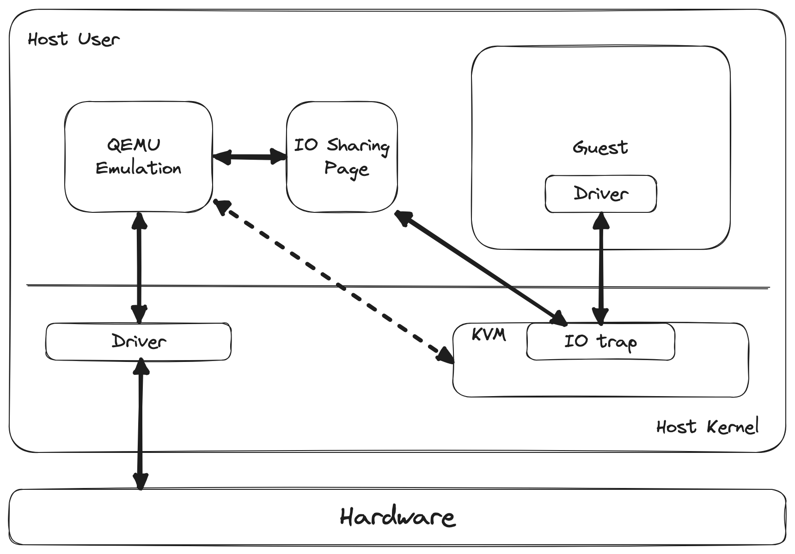
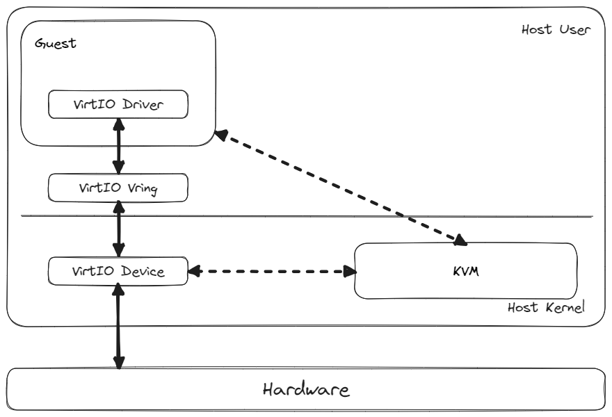
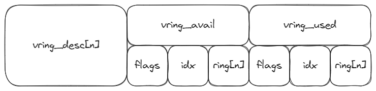

# VirtIO

# 产生背景
虚拟化技术是云计算的一项基础技术，它可以支持在物理设备上运行多个虚拟化节点。这些节点存在于虚拟化环境中，但通过虚拟化技术，要达到一种效果，即要让它们运行起来的表现与在物理环境中的独立节点相似。这就要求虚拟环境和客户机为虚拟设备提供一个简单、高效、标准的可扩展机制，这种机制就是 VirtIO 。 

## 全虚拟化
在 Linux 之上，常用的虚拟化架构是 KVM + QEMU 的方式。在 VirtIO 出现之前， 主要采用一种全虚拟化的方式，即 QEMU 作为纯软件运行在 KVM 之上，来自 GuestOS 的所有请求都经过 QEMU 至 KVM ，KVM 提供 CPU 和内存的虚拟化，其他请求如 I/O 请求被 KVM 捕获后，将该请求放到 I/O Sharing Page 中，并通知 QEMU ； QEMU 模拟出 I/O 请求，完成 Host Kernel 的系统调用。此过程有很明显的缺点，即调用路径过长，每次 KVM 捕获请求时，都需要完成 VM Exit 和 VM Entry ，并且存在多次的数据拷贝，影响交互性能。



1. Guest 发出 I/O 请求
2. KVM 捕获该 I/O 请求，并将该请求放到 I/O Sharing Page 中
3. KVM 通知 QEMU 有新的 I/O 请求
4. QEMU 模拟该 I/O 请求，完成系统调用
5. 硬件交互完成后，QEMU 将结果放回 I/O 共享页 
6. QEMU 通知 KVM 结果完成
7. KVM 读取共享页中的结果，并把结果返回给 Guest

## 半虚拟化
为了解决每次 I/O 请求都与 KVM 交互产生 VM Exit 和 VM Entry 进而影响性能的问题， VirtIO 应运而生。每当 GuestOS 产生了 I/O 请求，可以不需要立即通知 KVM ，而是将该请求放入 VirtIO 的数据交互模块 Vring 中。 Vring 的本质是一个环形队列，拥有头指针和尾指针，用来标注数据的存放的情况。可以通过设置通知 KVM 的条件来降低产生 VM Exit 和 VM Entry 的频率，从而提升交互性能。

但是该交互方式对 GuestOS 提出了新的要求。它需要对 GuestOS 进行修改，插入新的支持以上交互模式的驱动，即 VirtIO 的 Driver。该驱动需要支持通过 Vring 进行数据收发、配置 PCI 总线、 VirtIO 设备等，即对 OS 进行修改以适配 VirtIO 的交互，因此称之为半虚拟化模式。

VirtIO 加持下的半虚拟化场景中的 I/O 的交互流程如下：



1. Guest 发出 I/O 请求
2. 该请求放入 VirtIO Vring 的 Avail Ring 中
3. 选择**适当的时机**通知 KVM
4. KVM 通知 VirtIO Device 数据到达
5. VirtIO Device 从 Avail ring 中取数据并发送
6. 硬件交互完成后，VirtIO Device 更新 Used Ring
7. 选择**适当的时机**通知 KVM
8. KVM 通知 Guest I/O 请求结束

以上过程中提到的**适当的时机**，取决于 VirtIO Driver 和 Device 之间的协商。默认情况下，设置为每次有 I/O 请求就会触发通知机制，这样会导致频繁的 VM Exit 和 VM Entry，降低交互效率。VirtIO 提供标志位设置通知触发的条件，当 Vring 中存放的数据达到一个水线，可以触发通知机制，以降低前述场景带来的性能损耗。

# 基本组件
VirtIO 由三部分组成：Driver、Vring 和 Device，三者关系如上图所示。Driver 被称为 VirtIO 的前端，其以 GuestOS 中的内核驱动形式呈现；Device 被称为 VirtIO 的后端，处于 HostOS 的内核中；前后端的数据交互通过 Vring 实现，结构类似于环形队列。下面就基于 Linux 3.10 版本对 VirtIO 的实现进行简要分析。

## VirtIO Driver


## VirtIO Device


## Vring
Vring 是一种环形队列，其承担着前后端之间数据交互的作用。在一组前后端之间，可能存在 0 到 n 对 queue ，每一对 queue 都是由发送和接收队列组成。
### 结构体
Vring 的核心结构如下：
```c
struct vring {
	unsigned int num;
	struct vring_desc *desc;
	struct vring_avail *avail;
	struct vring_used *used;
};
```
从结构上看，每一个队列有一个 num 表征环形队列的大小。desc 表示描述符空间的起始地址，其基本结构如下：
```c
struct vring_desc {
	/* Address (guest-physical). */
	__virtio64 addr;
	/* Length. */
	__virtio32 len;
	/* The flags as indicated above. */
	__virtio16 flags;
	/* We chain unused descriptors via this, too */
	__virtio16 next;
};
```
描述符处在一片连续的地址空间中，该空间大小为 num * sizeof(struct vring_desc). addr 表示该描述符指向的客户机物理地址，该地址是存放数据的真实位置。len 表示存放数据的长度，flags 记录一些标志，比如 VRING_DESC_F_NEXT 表示还有下一个 desc 连接在该 desc 后，VRING_DESC_F_WRITE 表示该描述符是 Device 只写等。next 与 flags 的 VRING_DESC_F_NEXT 标志配合，记录链中下一个 desc 的索引。由于 desc 大小固定，且地址连续，因此可以通过索引找到下一个 desc 。
```c
struct vring_avail {
	__virtio16 flags;
	__virtio16 idx;
	__virtio16 ring[];
};
```
vring_avail 结构体用来描述可用的 desc ，"可用"是针对后端的 Device 而言的，表示还没有被后端所读取。可以将其中的 idx 理解为环形队列的 rear 指针，指向环形队列的尾部。ring 是一个数组，使用 idx 作为其索引，ring[idx] 表示当前 desc 的索引，通过 desc[ring[idx]] 可以找到当前描述符链的链首描述符。flags 记录一些标志， Host 应该忽略它。vring_avail 结构总是由前端(Guest)填充，后端(Host)读取，并且其所占用的空间大小固定为为 num * sizeof(vring_avail)，紧接在 vring_desc 空间之后。
```c
struct vring_used {
	__virtio16 flags;
	__virtio16 idx;
	struct vring_used_elem ring[];
};

struct vring_used_elem {
	/* Index of start of used descriptor chain. */
	__virtio32 id;
	/* Total length of the descriptor chain which was used (written to) */
	__virtio32 len;
};
```
vring_used 结构体用来描述已用的 desc ，"已用"表示后端已经完成了读取处理。可以将其中的 idx 理解为环形队列的 front 指针，指向环形队列的队尾。ring 与 vring_avail 中的 ring 的描述类似。

需要注意的是，在整个前后端交互的过程中，**desc 所指向的空间的分配都是由前端完成的**。在发送队列中，客户机分配好空间，将 I/O 请求填入 avail 中；而在接收队列，客户机需要事先分配好空间，填入到 avail 中，后端从中取得分配好的空间，填入数据，并更新 used ring 。

vring 结构体的内存布局：



几个对于理解 Vring 工作原理的重要的 Q & A：

Q: 前端在分配空间时，怎么知道分配空间的大小以及 desc 链的情况呢？

A: 前端初始分配空间时，会将所有的 desc 通过 next 链接在一起填入 avail 。

Q: 当有数据需要发送时，如何确定当前填充的 desc head 的索引？

A: 在 Guest 端会维护一个索引 free_head ，当需要填充 desc 时，free_head 即为可以填充的 desc 的索引。所有可以填充的 desc 索引通过 next 连接在一起，因此拿到了 free_head 就可以拿到所有可以填充的索引，按照 next 不停索引下一个 desc 填充相应数据即可。

Q: buff 回收的过程是怎样的？

当需要填充的数据填充完成后，会将 desc chain 的最后一个 desc 的 flags 置为 ~VRING_DESC_F_NEXT，表示没有下一个 desc 。在 buff 回收过程中，检测到 ~VRING_DESC_F_NEXT ，表示是需要回收的 desc chain 中的最后一个 desc 。此时，将该 desc 的 next 指向 free_head ，同时把 free_head 指向该 desc chain 的头部，完成 desc 的回收。

# 设备类型
## 网络设备
